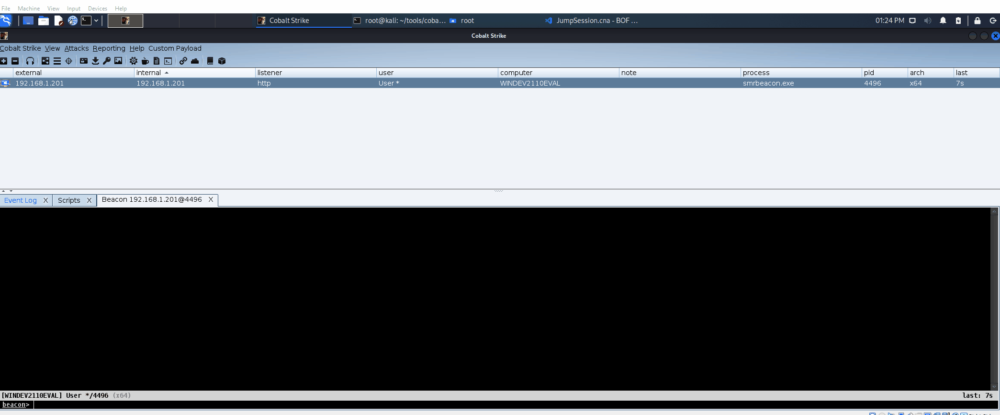

# JumpSession_BOF
This is a Beacon Object File allowing creation of Beacons in different sessions. Must be Elevated.




This BOF was created on the heels of research I did on [Session 1 -> Session 0 Migration](https://github.com/Octoberfest7/Mutants_Sessions_Self-Deletion#session-1---session-0-migration).  To understand what is happening under the hood I suggest you read the full writeup there. 

With an Elevated Beacon an operator may spawn a beacon in a different session; This may be session 0, so as to prevent losing your beacon should the victim log off, or even another user's session. 

A couple things to keep in mind:

1.  The "sessionpid" you select must be a process which has the SE_ASSIGNPRIMARYTOKEN_PRIVILEGE and SE_TCB_PRIVILEGE privileges.  This means you are going to be looking at system integrity processes, not high integrity ones ran by a user.  Note that PPL protected processes like smss.exe MAY be used here (and are in fact a desired target when jumping to session 0). Smss.exe is a good target for session 0, while winlogon is a good target for user sessions.

2.  The "parentpid" you select CAN NOT be PPL protected.  Ideally you will select a parentpid in the same session that you want to jump to; spoolsv is a good target for session 0, while winlogon is a good target for user sessions. 

3.  The Beacon in the new session will spawn as the same architecture as the Beacon that JumpSession was ran from; architecture migration is not supported. 

### To Compile:

**x64**
```
x86_64-w64-mingw32-gcc -o JumpSession.x64.o -Os -c main.c -DBOF
```

**x86**
```
i686-w64-mingw32-gcc -o JumpSession.x86.o -Os -c main.c -DBOF
```
